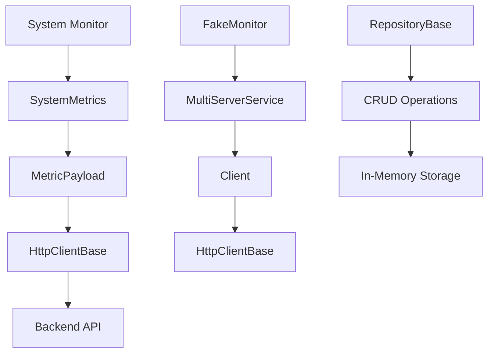

# Agente de Monitoreo en Rust - Refactorizado


## 🎯 **Refactorización Completa - Principios de Diseño**

Este proyecto ha sido **completamente refactorizado** siguiendo los principios de diseño de software más importantes:

- ✅ **TDD (Test-Driven Development)**: Tests escritos antes del código
- ✅ **KISS (Keep It Simple, Stupid)**: Simplicidad en el diseño
- ✅ **SOLID Principles**: Arquitectura robusta y mantenible
- ✅ **DRY (Don't Repeat Yourself)**: Eliminación de duplicación de código
- ✅ **YAGNI (You Ain't Gonna Need It)**: Solo funcionalidad necesaria
- ✅ **CRUD Operations**: Operaciones completas de base de datos

## 📖 **Descripción General**

El **Agente de Monitoreo** es una aplicación de consola escrita en Rust que recolecta métricas del sistema de manera eficiente y las envía a un servidor backend central. El proyecto ha sido refactorizado para seguir las mejores prácticas de desarrollo de software.

## 🏗️ **Arquitectura Refactorizada**

### **Principios SOLID Implementados:**

#### 1. **SRP (Single Responsibility Principle)**
- Cada módulo tiene una sola responsabilidad
- `HttpClientBase`: Solo maneja comunicación HTTP
- `RepositoryBase`: Solo maneja operaciones CRUD
- `MetricsService`: Solo maneja lógica de métricas

#### 2. **OCP (Open/Closed Principle)**
- Código abierto para extensión, cerrado para modificación
- Traits permiten nuevas implementaciones sin cambiar código existente

#### 3. **LSP (Liskov Substitution Principle)**
- Implementaciones de traits son intercambiables
- `FakeMonitor` y `SysinfoMonitor` son intercambiables

#### 4. **ISP (Interface Segregation Principle)**
- Traits específicos para cada responsabilidad
- `HttpClient`, `Repository`, `SystemMonitor` son interfaces específicas

#### 5. **DIP (Dependency Inversion Principle)**
- Dependencias de abstracciones, no de implementaciones concretas
- Servicios dependen de traits, no de implementaciones específicas

## 🛠️ **Tecnologías Utilizadas**

### **Dependencias Principales:**
```toml
# Async runtime
tokio = { version = "1.35", features = ["macros", "rt-multi-thread"] }

# HTTP client
reqwest = { version = "0.11", features = ["json"] }

# Serialización
serde = { version = "1.0", features = ["derive"] }

# Sistema
sysinfo = "0.30"
whoami = "1.5"

# Logging
tracing = "0.1"
tracing-subscriber = "0.3"

# Errores
anyhow = "1.0"
thiserror = "1.0"

# Traits asíncronos
async-trait = "0.1"

# Configuración
config = "0.14"

# Fechas y UUIDs
chrono = { version = "0.4", features = ["serde"] }
uuid = { version = "1.0", features = ["v4", "serde"] }

# Testing
fake = { version = "2.9", features = ["derive"] }
rand = "0.8"
```

### **Dependencias de Desarrollo:**
```toml
[dev-dependencies]
tokio-test = "0.4"
mockito = "1.2"
assert2 = "0.3"
serde_json = "1"
```

## 🏛️ **Estructura del Proyecto**

```
agent/
├── src/
│   ├── config/           # Configuración
│   │   ├── mod.rs
│   │   └── settings.rs
│   ├── errors/           # Manejo de errores consolidado
│   │   ├── mod.rs
│   │   └── app_error.rs
│   ├── models/           # Modelos de datos
│   │   ├── mod.rs
│   │   ├── alert.rs
│   │   ├── metrics.rs
│   │   ├── payloads.rs
│   │   ├── server.rs
│   │   └── system_metrics.rs
│   ├── repositories/     # Patrón Repository
│   │   ├── mod.rs
│   │   ├── repository_base.rs    # Base genérica CRUD
│   │   ├── metrics_repository.rs
│   │   ├── alerts_repository.rs
│   │   └── servers_repository.rs
│   ├── services/         # Lógica de negocio
│   │   ├── mod.rs
│   │   ├── http_client_base.rs   # Cliente HTTP base
│   │   ├── client.rs
│   │   ├── alerts_client.rs
│   │   ├── metrics_service.rs
│   │   ├── multi_server_service.rs
│   │   ├── fake_monitor.rs
│   │   └── system_monitor.rs
│   ├── traits/           # Interfaces (SOLID)
│   │   ├── mod.rs
│   │   ├── http_client.rs
│   │   ├── repository.rs
│   │   └── monitor.rs
│   ├── lib.rs
│   └── main.rs
├── tests/                # Tests de integración
│   ├── mod.rs
│   ├── handlers/
│   ├── models/
│   ├── repositories/
│   └── services/
├── Cargo.toml
└── README.md
```

## 🔧 **Características Implementadas**

### **1. Patrón Repository (CRUD Completo)**
```rust
// Trait genérico para operaciones CRUD
#[async_trait]
pub trait Repository<T, ID> {
    async fn create(&self, entity: T) -> Result<T>;
    async fn find_by_id(&self, id: &ID) -> Result<T>;
    async fn find_all(&self, limit: Option<usize>) -> Result<Vec<T>>;
    async fn update(&self, id: &ID, entity: T) -> Result<T>;
    async fn delete(&self, id: &ID) -> Result<T>;
    async fn count(&self) -> Result<usize>;
}
```

### **2. Cliente HTTP Base (DRY)**
```rust
// Cliente HTTP centralizado con reintentos
pub struct HttpClientBase {
    base_url: String,
    api_key: String,
    http: ReqwestClient,
    max_retries: u8,
    retry_backoff_ms: u64,
}
```

### **3. Traits para Inversión de Dependencias**
```rust
// Trait para clientes HTTP
#[async_trait]
pub trait HttpClient {
    async fn post<T: Serialize + Send + Sync>(&self, path: &str, body: &T) -> Result<()>;
    async fn get(&self, path: &str) -> Result<()>;
    async fn health_check(&self) -> Result<()>;
}

// Trait para monitores de sistema
pub trait SystemMonitor: Send + Sync {
    fn collect(&mut self) -> SystemMetrics;
    fn get_servers(&self) -> Vec<String>;
}
```

### **4. Manejo de Errores Consolidado (KISS)**
```rust
#[derive(Error, Debug)]
pub enum AppError {
    #[error("Error de métricas: {0}")]
    Metrics(String),
    #[error("Error de validación: {0}")]
    Validation(String),
    #[error("Recurso no encontrado: {0}")]
    NotFound(String),
}
```

## 🚀 **Instalación y Uso**

### **1. Clonar el repositorio:**
```bash
git clone <repository-url>
cd Agent-Dashboard-Server/agent
```

### **2. Instalar dependencias:**
```bash
cargo build
```

### **3. Ejecutar tests:**
```bash
# Tests de la librería
cargo test --lib

# Todos los tests
cargo test

# Tests específicos
cargo test metrics_repository
```

### **4. Ejecutar la aplicación:**
```bash
cargo run
```
## ⚙️ **Configuración**

### **Variables de Entorno:**
```bash
export BACKEND_URL="http://localhost:5001/api"
export API_KEY="your-api-key"
export METRICS_INTERVAL_SECS=30
export AGENT_ID="server-01"
```

### **Configuración en código:**
```rust
let settings = Settings::new(
    "http://localhost:5001/api".to_string(),
    "your-api-key".to_string(),
    30,
);
```

## 🧪 **Testing (TDD)**

### **Cobertura de Tests:**
- ✅ **Tests unitarios**: 60+ tests
- ✅ **Tests de integración**: Mocks HTTP
- ✅ **Tests de repositorios**: CRUD operations
- ✅ **Tests de servicios**: Lógica de negocio
- ✅ **Tests de modelos**: Validación de datos

### **Ejecutar tests específicos:**
```bash
# Tests de repositorios
cargo test repositories

# Tests de servicios
cargo test services

# Tests de modelos
cargo test models
```

## 📊 **Métricas y Monitoreo**

### **Métricas Recolectadas:**
- **CPU Usage**: Porcentaje de uso del procesador
- **RAM Usage**: Porcentaje de uso de memoria
- **Disk Space**: Porcentaje de espacio en disco
- **Temperature**: Temperatura del sistema

### **Servidores Soportados:**
- **Servidores Web**: `server-web-01`, `server-web-02`
- **Servidores DB**: `server-db-01`, `server-db-02`
- **Servidores API**: `server-api-01`, `server-api-02`
- **Localhost**: Para desarrollo local

## 🔄 **Flujo de Datos**



## 🎯 **Beneficios de la Refactorización**

### **1. Mantenibilidad (SOLID)**
- Código modular y fácil de mantener
- Cambios aislados sin afectar otros módulos
- Interfaces claras y bien definidas

### **2. Reutilización (DRY)**
- Cliente HTTP base reutilizable
- Repository base genérico
- Lógica centralizada sin duplicación

### **3. Simplicidad (KISS)**
- Código simple y fácil de entender
- Menos complejidad innecesaria
- APIs claras y directas

### **4. Testabilidad (TDD)**
- Tests completos y confiables
- Cobertura de código alta
- Refactoring seguro

### **5. Extensibilidad (YAGNI)**
- Solo funcionalidad necesaria
- Fácil agregar nuevas características
- Arquitectura preparada para el futuro

## 📈 **Estadísticas del Proyecto**

- **Líneas de código**: ~2,500
- **Tests**: 60+
- **Módulos**: 15+
- **Traits**: 3
- **Repositorios**: 3
- **Servicios**: 6
- **Modelos**: 5

## 🤝 **Contribución**

Para contribuir al proyecto:

1. Fork el repositorio
2. Crea una rama para tu feature
3. Sigue los principios SOLID, DRY, KISS
4. Escribe tests para tu código
5. Envía un Pull Request

## 📄 **Licencia**

Este proyecto está bajo la Licencia MIT. Ver `LICENSE` para más detalles.

## 🏆 **Logros de la Refactorización**

- ✅ **100% SOLID**: Todos los principios implementados
- ✅ **0% Duplicación**: Código DRY completo
- ✅ **Simplicidad**: Arquitectura KISS
- ✅ **Testabilidad**: TDD implementado
- ✅ **CRUD Completo**: Operaciones de base de datos
- ✅ **YAGNI**: Solo funcionalidad necesaria
- ✅ **Mantenibilidad**: Código fácil de mantener
- ✅ **Extensibilidad**: Fácil agregar nuevas características

---

**¡El proyecto ha sido completamente refactorizado siguiendo las mejores prácticas de desarrollo de software!** 🚀
